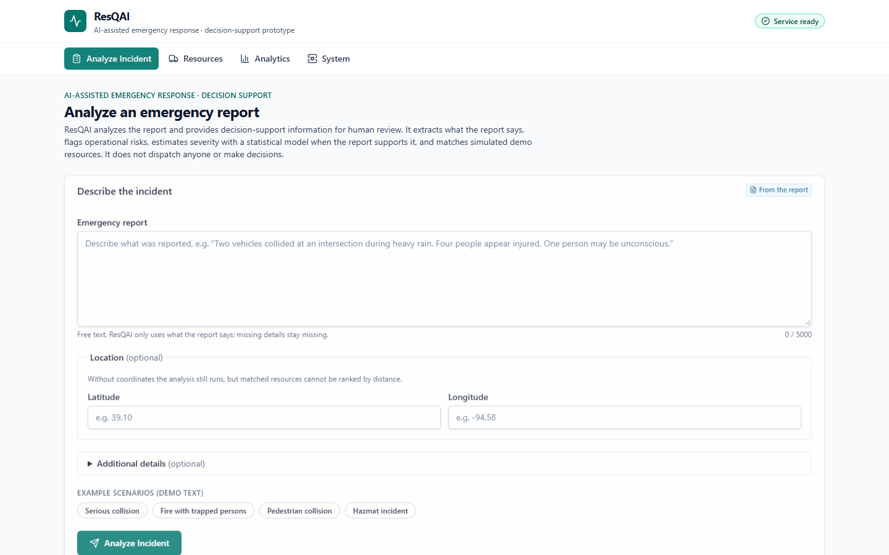
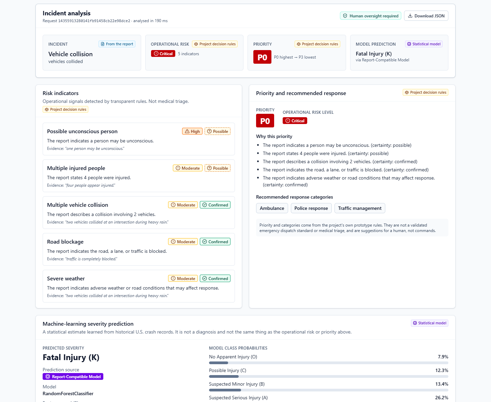
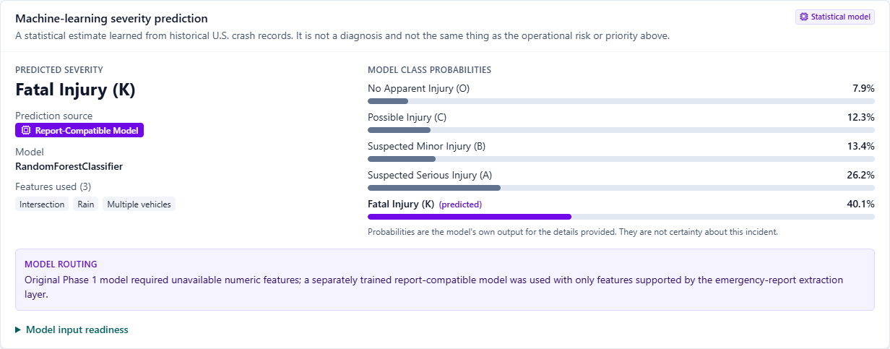
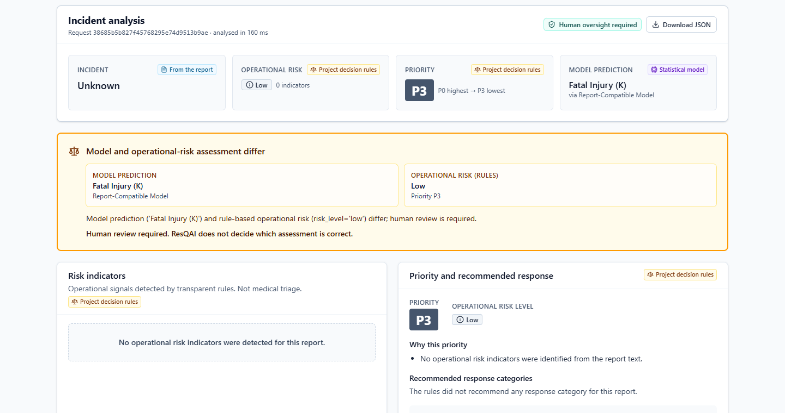
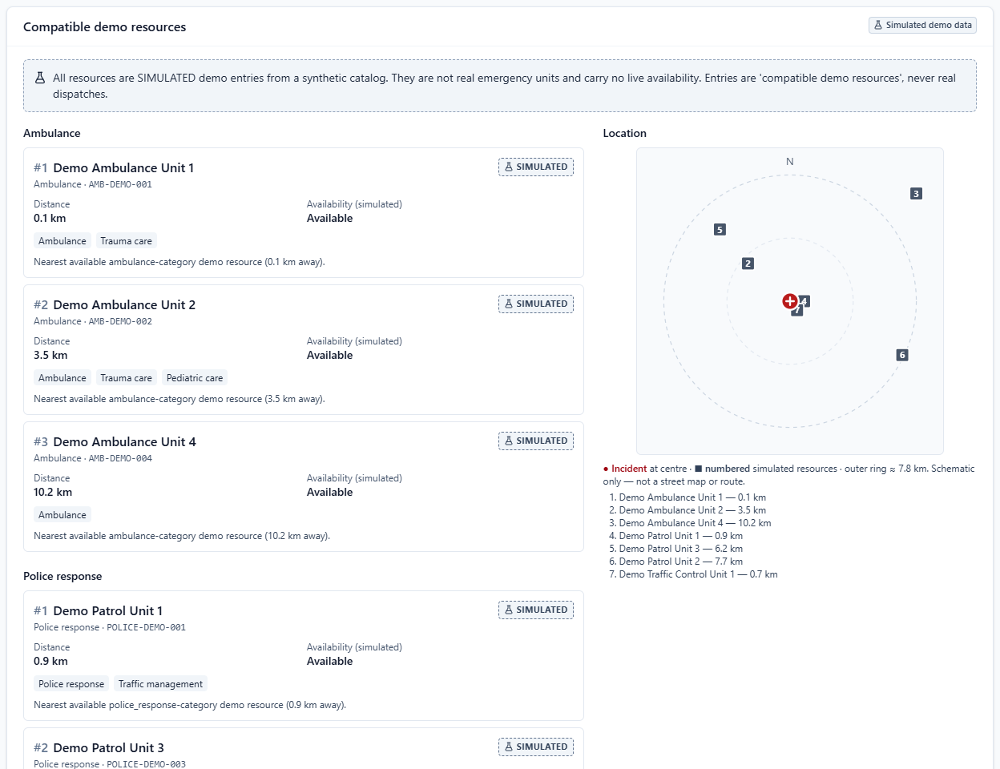
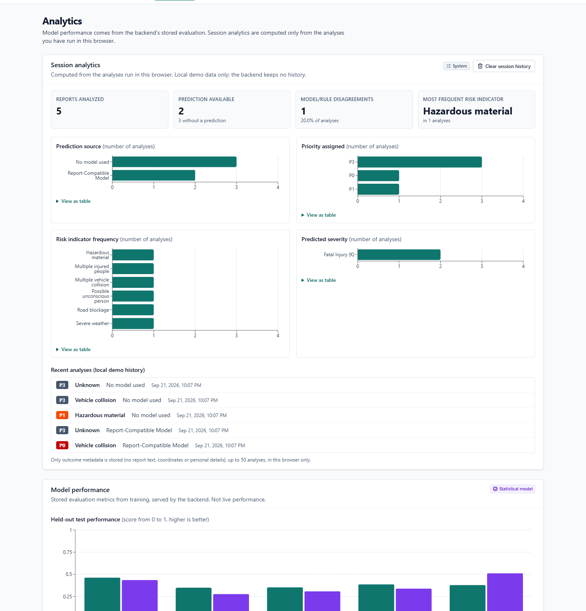
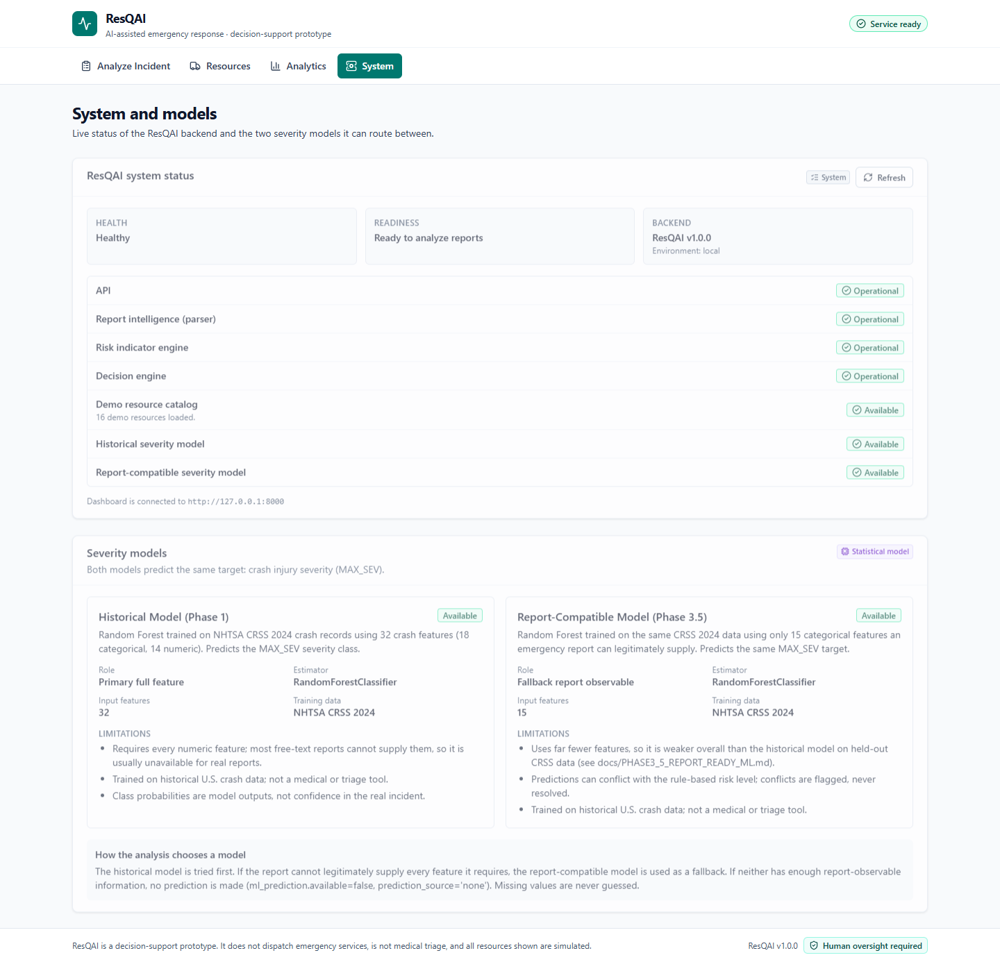
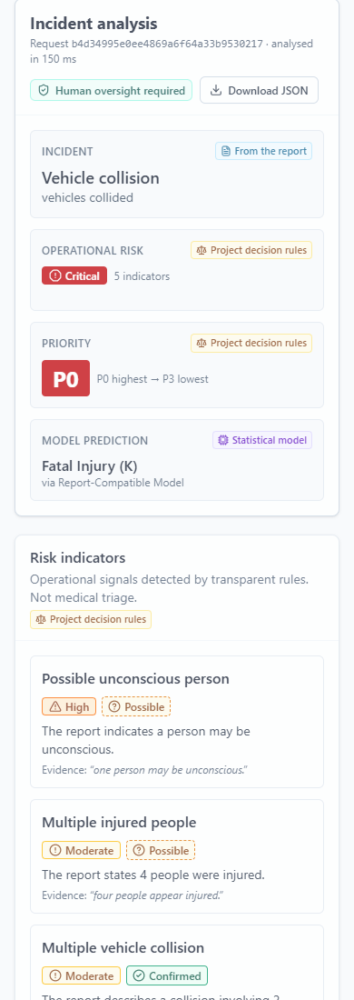
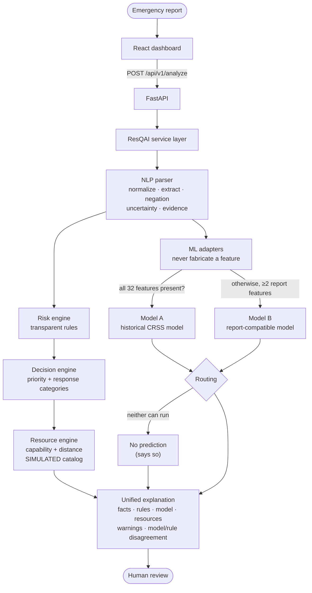

# ResQAI

**AI-Assisted Emergency Response & Decision Support System** — a portfolio prototype that turns an unstructured emergency report into structured, explainable decision-support information for a **human** reviewer.

ResQAI extracts what a report says (with the supporting wording and how certain it was), flags operational risks with transparent rules, estimates crash severity with machine-learning models **only when the report legitimately supports it**, assigns a rule-based priority, and matches **simulated** demo resources — and it shows, side by side, which part came from where. It is built end to end: a CRSS data-science pipeline, a deterministic NLP layer, a FastAPI backend and a React dashboard.

> **Not** autonomous dispatch, **not** medical triage, **not** validated for real use, **not** connected to any emergency service. Resources are synthetic. Read [docs/RESPONSIBLE_USE.md](docs/RESPONSIBLE_USE.md).

| | |
|---|---|
| **Live demo** | **Not deployed yet.** Deployment is prepared and rehearsed locally but needs an account authorization — see [docs/LIVE_DEMO.md](docs/LIVE_DEMO.md) and [docs/DEPLOYMENT.md](docs/DEPLOYMENT.md). No public URL is claimed. |
| Version | 1.0.0 ([`VERSION`](VERSION), [CHANGELOG](CHANGELOG.md), [RELEASE](RELEASE.md)) |
| API docs (when running) | `http://127.0.0.1:8000/docs` · contract in [docs/API.md](docs/API.md) |

## Screenshots

Captured from the real production build talking to the real API (no mock data).

| Analyze | Result overview |
|---|---|
|  |  |
| **ML prediction, source and probabilities** | **Model / rule disagreement** |
|  |  |
| **Simulated resources + location plot** | **Analytics (session + model metrics)** |
|  |  |
| **System status** | **Mobile** |
|  |  |

## Problem

Emergency reports are short, informal, incomplete and hedged ("may be unconscious"). Dispatch support needs structure — but a system that fills gaps with guesses is dangerous. The challenge is to be *useful without inventing anything*.

## Solution



Frontend = presentation only. Backend = HTTP/application layer. Core (`src/`) = all intelligence. React never re-implements NLP, ML, risk, ranking or feature mapping.

## Key features

- **Evidence and uncertainty everywhere:** every extracted field carries its value, a certainty (confirmed / possible / uncertain) and the report wording behind it; negation ("no one was injured") is respected.
- **Model source is always visible:** historical model, report-compatible model, or none; features used; all class probabilities; a routing note.
- **Model vs. rules are never merged:** three separate ideas — the statistical model, the operational risk, the project-defined priority — and a calm "human review required" panel when the model and rules disagree.
- **No fabrication:** missing information stays missing; the adapters return "no prediction" instead of guessing.
- **Simulated resources, always labelled** (synthetic IDs like `AMB-DEMO-001`); honest handling of missing location.
- **Analytics from real data only:** session analytics computed from analyses run in the browser; model metrics served by the backend from the stored evaluation.

## Data-science pipeline (Phase 1)

NHTSA **CRSS 2024** (`accident.csv` as the base, `vehicle.csv`/`person.csv` aggregated per crash; 50,654 crashes, validated joins, no duplicate keys). Target `MAX_SEV`, 5 classes, imbalanced (Fatal 2.2 %). Leakage control: target restatements and vehicle/person **outcome** columns are excluded. Features: 18 categorical + 14 numeric, NHTSA-imputed variants preferred. Stratified 80/20 split (seed 42), logistic-regression baseline vs. class-weighted Random Forest, full metrics (not just accuracy). Details: [docs/ML_PIPELINE.md](docs/ML_PIPELINE.md), [docs/MODEL_CARD.md](docs/MODEL_CARD.md).

## NLP pipeline (Phase 2)

Validation → conservative normalization → **deterministic** extraction (regex + shared negation/hedging rules) into a typed `IncidentReport` (people, vehicles, fire, hazmat, environment, location context, traffic, emergency services) → risk indicators → decision rules. Deterministic by design (same input, same output), no LLM, no network. Details: [docs/REPORT_INTELLIGENCE.md](docs/REPORT_INTELLIGENCE.md).

## ML models

| | Model A — Historical | Model B — Report-compatible |
|---|---|---|
| Features | 32 (18 cat + 14 num) | 15, all categorical |
| Runs when | every numeric input is present (rare from free text) | ≥ 2 report-observable features |
| Accuracy / macro F1 | 0.4625 / 0.3496 | 0.4355 / 0.2775 |
| Fatal-class recall / precision | 0.379 / 0.112 | 0.511 / 0.084 |
| Size | 84.6 MB | 14.8 MB |

Held-out test split (10,131 rows), from the stored metrics. **Neither model is "best"** — different inputs, different trade-offs.

**Why a second model:** a mixed categorical + numeric pipeline (`StandardScaler`) rejects missing numeric values, and real reports almost never state them. Model B is trained only on features a report can legitimately state and is all-categorical, so any subset can be missing. Details: [docs/PHASE3_5_REPORT_READY_ML.md](docs/PHASE3_5_REPORT_READY_ML.md).

**Known limitation, investigated and documented:** Model B tends to predict *Fatal Injury (K)* for sparse reports (it predicts Fatal 6.1× more often than it occurs on the test split). Phase 6 traced it: one real extraction bug (fixed) plus a genuine modeling limitation (class weighting + missing features unseen in training), preserved and surfaced rather than hidden — [docs/FATAL_SKEW_REVIEW.md](docs/FATAL_SKEW_REVIEW.md).

## Explainability

Evidence snippets per field, certainty badges, "what is uncertain", rule reasons per risk indicator, the model's routing note and probabilities, and explicit model/rule disagreement — all returned by the API and rendered by the UI. See [docs/DEMO_SCENARIOS.md](docs/DEMO_SCENARIOS.md) (generated from real outputs for 7 scenarios).

## Resource engine

Local, dependency-free: Haversine distance, capability and availability matching against a **synthetic** catalog (`data/resources/demo_resources.csv`). Without coordinates it lists capability matches unranked and says so. Nothing is live.

## API (FastAPI)

`POST /api/v1/analyze`, `GET /health`, `/ready`, `/resources`, `/models`, `/models/metrics`; typed schemas, structured error envelope, request ids, privacy-safe logs (no report text or coordinates), configurable CORS, models and catalog loaded once. See [docs/API.md](docs/API.md).

```powershell
Invoke-RestMethod -Method Post -Uri "http://127.0.0.1:8000/api/v1/analyze" -ContentType "application/json" `
  -Body '{"raw_text":"Two vehicles collided at an intersection during heavy rain. Traffic is blocked."}'
```

## Dashboard (React)

Analyze · Resources · Analytics · System. TypeScript (strict), Tailwind, Recharts, typed API client, accessible and responsive (verified at 1440/820/390 px). See [docs/FRONTEND.md](docs/FRONTEND.md).

## Testing

| Suite | Result |
|---|---|
| Backend (`pytest -q`) | **289 passed** |
| Frontend (`npm test`) | **102 passed** with a backend running (96 without one; the other 6 are live tests against a real backend and skip cleanly if none is running) |
| Real-browser E2E on the production bundles (Chrome/Playwright; run during development, script not committed) | five reference scenarios, failure modes (backend down, CORS-blocked origin, slow backend), mobile layout |
| Deployment rehearsal from a clean-clone copy | model download + checksum verification, tamper/unreachable failure modes |

`python scripts/live_smoke_test.py <api-url>` runs a dependency-free API smoke test against any running or deployed backend.

## Deployment

Render Blueprint (`render.yaml`, validated against Render's schema): static site + FastAPI service from one repo. Model binaries are **not** in Git — they are versioned GitHub Release assets that the API downloads and **SHA-256-verifies** at startup (a bad file is never used, and readiness reports it). **Status: prepared and rehearsed locally, not yet deployed.** Free-plan limits (spin-down after 15 idle minutes, ~1-minute wake, models re-downloaded) are documented in [docs/DEPLOYMENT.md](docs/DEPLOYMENT.md).

## Limitations

Modest model accuracy and the Fatal-class skew above; deterministic extraction misses unusual wording and can label some incidents "unknown" (e.g. a pedestrian strike); crash-trained models say little about fires or hazmat events; synthetic resources; no authentication or rate limiting; not exercised on the hosting platform yet; trained on one year of U.S. data. See [docs/RESPONSIBLE_USE.md](docs/RESPONSIBLE_USE.md).

## Local setup

Requires Python 3.13 (see `.python-version`) and Node 20.19+ / 22.12+. The trained models are git-ignored: regenerate them locally (needs the CRSS CSVs under `data/raw/`, see [docs/ML_PIPELINE.md](docs/ML_PIPELINE.md)):

```powershell
python -m venv .venv
.venv\Scripts\python.exe -m pip install -r requirements.txt
.venv\Scripts\python.exe src\train_model.py
.venv\Scripts\python.exe src\train_report_compatible_model.py

# terminal 1 — backend (from the project root)
.venv\Scripts\python.exe -m uvicorn src.api.main:app

# terminal 2 — frontend
cd frontend
npm install
npm run dev            # http://127.0.0.1:5173
```

Run everything: `pytest -q` · `cd frontend; npm test; npm run build`. CLI demos: `python -m src.report_parser`, `python -m src.resqai_service`, `python -m src.coverage_benchmark`. The frontend reads `VITE_API_BASE_URL` (see `frontend/.env.example`); to allow another frontend origin, start the backend with `RESQAI_ALLOWED_ORIGINS`.

## Project structure

```
ResQAI/
├── src/                 core intelligence: parser, extraction/, risk, decision, ML adapters + predictor,
│                        location + resource engines, orchestrator; api/ = the thin FastAPI layer
├── tests/               backend tests (pytest)
├── frontend/            React + TypeScript dashboard (Vite) and its tests
├── data/resources/      synthetic demo resource catalog   (data/raw is git-ignored)
├── deployment/          model manifest (checksums), safe metadata + metrics JSON
├── scripts/             fatal-skew review, release assets, demo scenarios, smoke test
├── docs/                architecture, model card, API, frontend, deployment, responsible use, screenshots
└── render.yaml  requirements.txt  requirements-api.txt  VERSION  CHANGELOG.md  RELEASE.md
```

## Responsible use

Decision support only; human oversight required; simulated resources; not medically validated; do not enter real personal or emergency information into any public demo. Full statement: [docs/RESPONSIBLE_USE.md](docs/RESPONSIBLE_USE.md).

## Documentation

[ML pipeline](docs/ML_PIPELINE.md) · [Report intelligence](docs/REPORT_INTELLIGENCE.md) · [Phase 3 integration](docs/PHASE3_INTEGRATION.md) · [Report-compatible ML](docs/PHASE3_5_REPORT_READY_ML.md) · [Model card](docs/MODEL_CARD.md) · [Fatal-skew review](docs/FATAL_SKEW_REVIEW.md) · [API](docs/API.md) · [Frontend](docs/FRONTEND.md) · [Deployment](docs/DEPLOYMENT.md) · [Demo scenarios](docs/DEMO_SCENARIOS.md) · [Live demo status](docs/LIVE_DEMO.md)
