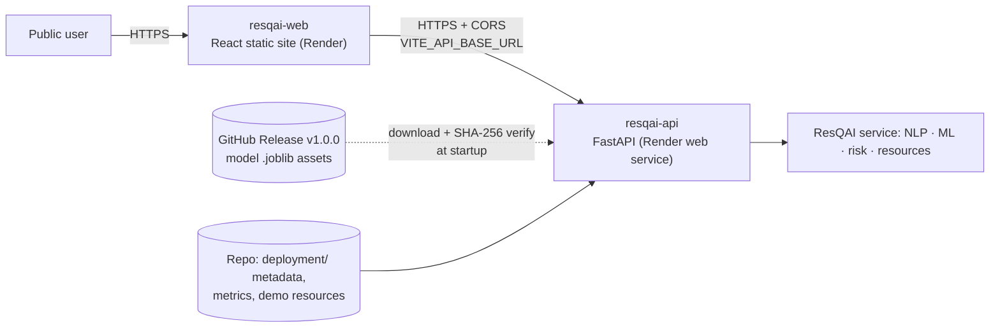

# Deployment guide

> **Status (honest):** everything below has been built and **rehearsed locally from a clean-clone copy** (§9). The application has **not** been deployed to Render (or anywhere public) yet, and the GitHub release assets have **not** been uploaded — both need an interactive account authorization that could not be completed from the development environment. §10 lists the exact remaining steps. Nothing here claims a live URL.

## 1. Architecture



One Git repository, two Render services (`render.yaml`). The backend runs from the **repository root** (it needs `src/`, `data/resources/`, `deployment/`); only the static site uses `rootDir: frontend`. No database, no auth, no raw CRSS data, no secrets.

## 2. Prerequisites

- The GitHub repository (`origin`) and a Render account connected to it.
- The model release assets uploaded to a GitHub release (§3).
- Locally, to (re)build assets/tests: Python 3.13.7, Node 20.19+/22.12+ (developed on Node 24.19.0).

## 3. Model artifact strategy

The trained models are git-ignored (correctly — 84.6 MB + 14.8 MB) and are **not committed**. Instead:

| Piece | Where | Purpose |
|---|---|---|
| Model binaries | GitHub **Release** assets, tag `v<VERSION>` | versioned, immutable-by-convention downloads |
| `deployment/model_artifacts.json` | tracked | release tag, base URL, and each asset's **SHA-256 and exact size** |
| `deployment/model_metadata/`, `deployment/model_metrics/` | tracked | small, safe public JSON (feature schema, evaluation metrics), **byte-identical** to the originals; pinned by checksum; `.gitattributes` prevents line-ending rewrites |
| `src/api/artifacts.py` | code | at startup: install tracked JSON, then for each model keep it if the checksum matches, else download → verify size + SHA-256 → atomically install. **A file failing verification is never installed.** |

Pinned assets (v1.0.0): `random_forest.joblib` (84,596,634 bytes, `sha256 12e42781…8bd1`) and `report_compatible_random_forest.joblib` (14,816,714 bytes, `sha256 64502767…4410`). Full values are in the manifest and in `release-assets/SHA256SUMS.txt`.

**Publishing a release** (run from the project root, after training; `release-assets/` is git-ignored):

```powershell
python scripts/prepare_release_assets.py      # copies models, computes SHA-256, rewrites the manifest
```

Then create the GitHub release **named by the tag in `VERSION`** (`v1.0.0`) and attach the files in `release-assets/`. Either in the GitHub web UI (Releases → Draft a new release → tag `v1.0.0` → attach the three files), or, if the GitHub CLI is installed and authenticated (`gh auth login`):

```powershell
gh release create v1.0.0 release-assets/random_forest.joblib release-assets/report_compatible_random_forest.joblib release-assets/SHA256SUMS.txt --title "ResQAI v1.0.0 model artifacts" --notes "Inference artifacts; see docs/MODEL_CARD.md"
```

Verify the upload independently (must print the pinned hash):

```powershell
curl.exe -L -s https://github.com/<owner>/<repo>/releases/download/v1.0.0/report_compatible_random_forest.joblib -o $env:TEMP\m.joblib
certutil -hashfile $env:TEMP\m.joblib SHA256
```

Changing a model = train → `prepare_release_assets.py` → new `VERSION` → new release → commit the regenerated manifest.

## 4. Environment variables

**Backend** (`resqai-api`)

| Variable | Production value | Purpose |
|---|---|---|
| `PYTHON_VERSION` | `3.13.7` | Render needs a fully qualified version; matches `.python-version` and the runtime the models were trained/verified with |
| `RESQAI_ENV` | `production` | environment label shown by `/health` |
| `RESQAI_LOG_LEVEL` | `INFO` | log verbosity |
| `RESQAI_BOOTSTRAP_MODELS` | `true` | verify/download the pinned artifacts at startup (default `false` for local dev, which uses your own `models/`) |
| `RESQAI_REQUIRE_MODELS` | `true` | `/ready` is `NOT_READY` unless **both** models loaded |
| `RESQAI_ALLOWED_ORIGINS` | *(dashboard entry, `sync: false`)* | the frontend's public origin, no trailing slash. Never `*` |
| `RESQAI_MODEL_ARTIFACT_BASE_URL` | *(unset)* | optional override of the manifest's base URL (https only; http allowed for localhost rehearsals) |

**Frontend** (`resqai-web`): `NODE_VERSION=24.19.0`; `VITE_API_BASE_URL` = the API's public origin (`sync: false`). It is baked into the bundle at build time, so changing it requires a **rebuild**. A production build made without it refuses to call anything (it does not fall back to localhost) and tells the user the dashboard has no backend configured. No secrets belong in `VITE_` variables.

## 5. Backend configuration (`render.yaml`)

`runtime: python`, `plan: free`, build `pip install -r requirements-api.txt` (exact, fully-pinned runtime closure; no matplotlib/pytest), start `uvicorn src.api.main:app --host 0.0.0.0 --port $PORT --no-server-header` (no `--reload`), `healthCheckPath: /api/v1/ready`.

Why `/ready` rather than `/health`: `/health` always answers 200 (even degraded), so a deploy whose models failed to download would look healthy. With `RESQAI_REQUIRE_MODELS=true`, `/ready` returns 503 in that case. It performs no model inference (it probes the parser/risk/decision code and checks that models/catalog are loaded), so it is cheap.

## 6. Frontend configuration (`render.yaml`)

`runtime: static`, `rootDir: frontend`, build `npm ci && npm run build`, publish `dist`, plus a `rewrite /* → /index.html` route so deep links (`/analytics`, `/system`) work on reload (verified locally with `vite preview`).

## 7. Render Blueprint — keys verified

`render.yaml` was validated against Render's published JSON schema (`https://render.com/schema/render.yaml.json`): **0 errors**, with negative controls (wrong enum, missing required key, wrong type) confirming the validator catches real mistakes. Caveat: that schema does not reject *unknown* keys; every key used was checked to exist in the schema's service definitions. The Blueprint has **not** been run on Render.

## 8. Health, readiness, CORS, errors, logging

- `GET /api/v1/health` — liveness + per-component status (`healthy`/`degraded`/`unavailable`), always HTTP 200. `GET /api/v1/ready` — `READY` (200) / `NOT_READY` (503).
- **CORS:** only the origins in `RESQAI_ALLOWED_ORIGINS`; no credentials; methods GET/POST/OPTIONS. Verified in a real browser: an allowed origin works; a non-allowed origin is blocked by the browser and the UI reports the service as unreachable without exposing internals.
- **Public errors** never contain stack traces, paths, model paths or environment values (the model-load error text, which contains a path, is replaced by a generic notice; details go to server logs only). Verified by tests and by probing the running API (`/.env`, `/models/*.joblib`, `/data/raw/...`, `/.git/config`, traversal attempts → generic 404).
- **Logs** hold request id, method, path, status, duration and model availability — never report text or coordinates.
- Abuse safety: text length limit (5000), strict schema (unknown fields rejected), pattern-restricted ids, nothing executed or used in paths. A real deployment would additionally need gateway rate limiting and authentication (not included).

## 9. Local rehearsal (what was actually verified)

A copy of exactly the files Git would commit (164–175 files, ~2 MB; **no** `models/`, `artifacts/`, `data/raw`, `.venv`) was run in a clean virtualenv built only from `requirements-api.txt`, with the release assets served from a local HTTP server:

| Check | Result |
|---|---|
| Clean install of pinned closure (Python 3.13.7) | 24 packages; Linux (manylinux x86_64, cp313) wheels exist for all 24 |
| Bootstrap from empty `models/` | downloaded, verified, loaded both models; `/ready` = `READY` |
| Tampered model (1 byte flipped) | rejected, not installed, no temp file left; `/ready` = `NOT_READY` (path-free reason); `/health` = `degraded`; `/analyze` still returns a rule-based analysis |
| Unreachable release | nothing installed; same safe outcome |
| Startup (this machine, local download) | cold 5.5 s, warm 4.4 s process-start → ready; importing the app 1.5 s. A very first run in a fresh venv took ≈22 s (bytecode compilation + cold disk) |
| Memory | 266 MB steady, **326 MB peak** working set |
| `/analyze` latency | 0.35–0.45 s end-to-end via curl (5 sequential calls; first call 0.45 s) |
| Frontend bundle | 337.9 kB JS (102.8 kB gzip) + 382.8 kB lazy analytics chunk (110.2 kB gzip) + 26.3 kB CSS; 745 kB total `dist` |

**Not verified:** behaviour on Render's Linux runtime (the models were trained and loaded on Windows/Python 3.13.7/scikit-learn 1.9.1; loading is expected to work on Linux with the same versions but this was not tested); timings on Render's hardware.

## 10. Remaining one-time steps (require your authorization)

1. Create GitHub release `v1.0.0` and upload the three files from `release-assets/` (§3); verify the download hash.
2. In Render: **New → Blueprint**, connect the repository (the repo must contain this commit). When prompted for the two `sync: false` variables, enter placeholders if the URLs are not known yet.
3. After both services exist, set `RESQAI_ALLOWED_ORIGINS` (API) to the web service's URL and `VITE_API_BASE_URL` (web) to the API's URL, then redeploy the **web** service (rebuild) — the API restarts on env change.
4. Verify: `GET <api>/api/v1/ready` → `READY`; open the web URL; analyze a report; run the live checks in `docs/LIVE_DEMO.md`.

## 11. Cold starts and the free plan (from Render's documentation)

- Free web services **spin down after 15 minutes without inbound traffic and take about a minute to spin back up**; the filesystem is **ephemeral**, so the models are **re-downloaded (≈99 MB) and reloaded on every cold start**.
- Free instance: **512 MB RAM, 0.1 CPU** (Render pricing page, 2026-09-21). Peak memory measured here (326 MB) fits, but 0.1 CPU will make loading and the first requests slower than the numbers in §9 — **not measured**.
- The dashboard copes: on first load it retries the backend patiently and shows "Waking up service…" instead of failing (tested). A paid plan avoids spin-down; nothing was purchased or selected automatically.

## 12. Troubleshooting

| Symptom | Likely cause / check |
|---|---|
| `/ready` = 503, reason names a model | asset missing on the release, wrong tag, or checksum mismatch → check API logs for `event=model_artifacts ... failed` |
| Dashboard says "Dashboard is not connected to a backend" | `VITE_API_BASE_URL` unset when the web service was built → set it and rebuild |
| Dashboard says the service "could not be reached" and browser console shows a CORS block | `RESQAI_ALLOWED_ORIGINS` does not exactly equal the web origin (scheme + host, no trailing slash) |
| Deep link 404 on reload | the `rewrite /* → /index.html` route is missing |
| Long first load | free-plan cold start (§11) |

## 13. Rollback

- **Code/config:** redeploy a previous commit from the Render dashboard, or `git revert` the release commit and push (autoDeployTrigger is `commit`).
- **Model artifacts:** the manifest pins a release tag and checksums, so reverting `deployment/model_artifacts.json` (and `VERSION`) to an earlier commit restores that release's models; old release assets remain on GitHub. For v1.0.0 there is **no previous release** yet.

## 14. Known limitations

No authentication or rate limiting; free-plan spin-down and re-download; not yet exercised on Render; the fatal-class skew and other model limits in `docs/FATAL_SKEW_REVIEW.md` and `docs/MODEL_CARD.md`; resources are simulated.
