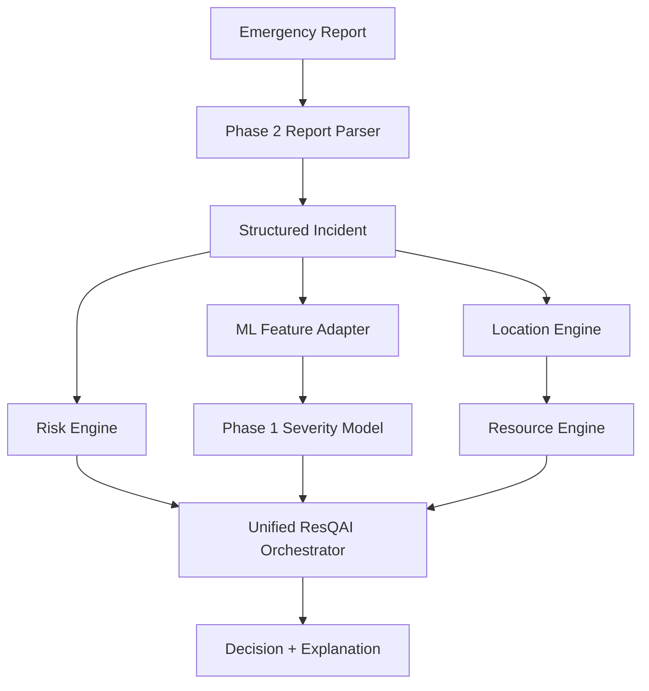

# Phase 3: Integration Layer

## 1. Phase 3 objective

Phase 3 connects the previously separate ResQAI subsystems -- Phase 1
(a trained crash-severity ML pipeline) and Phase 2 (deterministic
emergency-report parsing, risk indicators, and decision rules) -- with
two new local components (a location engine and a synthetic resource
engine) into one coordinated analysis flow, behind a single public
function: `resqai_service.analyze_emergency_report()`.

**ResQAI remains a decision-support prototype.** Every result carries
`human_oversight_required = True`. Nothing in Phase 3 dispatches real
emergency services, performs medical diagnosis, or claims validated
accuracy, life-saving impact, or production readiness.

## 2. Architecture



Component boundaries (single responsibility each):

| Module | Responsibility |
|---|---|
| `report_parser.py` (Phase 2) | validate -> normalize -> extract -> risk_engine -> decision_engine |
| `ml_adapter.py` | map `IncidentReport` -> Phase 1 feature schema; compute `PredictionReadiness` |
| `severity_predictor.py` | load/wrap the trained Phase 1 pipeline; predict or fail cleanly |
| `location_engine.py` | validate coordinates; Haversine distance |
| `resource_engine.py` | load demo catalog; filter/match/rank resources |
| `orchestrator.py` | coordinate the above, ONCE each, into `UnifiedResQAIResult` -- no component logic duplicated here |
| `resqai_service.py` | the one public function + CLI demo |

`orchestrator.py` calls `report_parser.parse_report()`, which already
runs Phase 2's risk engine and decision engine internally -- Phase 3
does not call `risk_engine`/`decision_engine` a second time or
reimplement any part of them.

## 3. Phase 1 integration

The adapter (`ml_adapter.py`) was built by INSPECTING, not
recreating, Phase 1's actual artifacts:

- `CATEGORICAL_FEATURES` / `NUMERIC_FEATURES` are imported directly
  from `src/feature_engineering.py` (the single source of truth Phase
  1 trains against), via a small `sys.path` bootstrap in `src/__init__.py`
  that lets Phase 3 import Phase 1's bare-import-style modules without
  rewriting a single Phase 1 file (see that file's docstring).
- The exact trained category vocabulary (e.g. `WEATHR_IMNAME`'s
  `['Blowing Sand, Soil, Dirt', 'Blowing Snow', 'Clear', 'Cloudy',
  'Fog, Smog, Smoke', 'Freezing Rain or Drizzle', 'Other', 'Rain',
  'Severe Crosswinds', 'Sleet or Hail', 'Snow']`) was read directly
  off the fitted `OneHotEncoder.categories_` inside
  `models/random_forest.joblib` before writing any mapper -- not
  guessed. Every literal string used in `ml_adapter.py`'s mappers
  (e.g. `"Not an Intersection"`, `"Rollover/Overturn"`, `"Rain"`) is a
  verified member of that vocabulary.
- The model is used strictly for INFERENCE. `severity_predictor.py`
  never retrains, never calls `.fit()`, and the training code
  (`train_model.py`) is untouched and uncalled by Phase 3.

**Key empirical finding** (verified by directly probing the saved
pipeline, documented in `ml_adapter.py`'s module docstring): its
`OneHotEncoder(handle_unknown="ignore")` tolerates a missing
(`NaN`) categorical value -- it's simply treated as an unrecognized
category. Its `StandardScaler` does **not** tolerate a missing numeric
value -- `pipeline.predict()` raises `ValueError: Input X contains
NaN` if any numeric column is `NaN`. This single fact drives the
entire readiness design in section 6 below.

## 4. Feature mapping table

18 categorical + 14 numeric = 32 features. `mapping_type` is one of
`deterministic` (unambiguous fact when present), `ambiguous`
(best-effort proxy/tie-break, documented), or `unsupported` (no Phase
2 field maps to this feature, for any report, today).

| Phase 1 feature | Phase 2 source | mapping_type |
|---|---|---|
| MONTHNAME, DAY_WEEKNAME, HOUR_IMNAME, time_of_day, is_weekend | `IncidentReport.timestamp` (caller-supplied metadata, parsed with `datetime.fromisoformat`) | deterministic |
| WEATHR_IMNAME | `environment.{fog,snow,strong_wind,heavy_rain,rain}` (fixed priority order when multiple co-occur) | ambiguous |
| RELJCT1_IMNAME | `location_context.intersection` (True->"Yes", False->"No") | deterministic |
| TYP_INTNAME | `location_context.intersection` -- **only** the confirmed-False case ("Not an Intersection"); True is ambiguous (many subtypes) and left unmapped | ambiguous |
| RELJCT2_IMNAME | same as TYP_INTNAME, confirmed-False -> "Non-Junction" | ambiguous |
| EVENT1_IMNAME | `vehicles.rollover` -- **only** the True case ("Rollover/Overturn"); a generic collision doesn't identify which of ~50 event categories applies | ambiguous |
| LGTCON_IMNAME, URBANICITYNAME, REL_ROADNAME, MANCOL_IMNAME, WRK_ZONENAME, SCH_BUSNAME, INT_HWYNAME, ALCHL_IMNAME | none | unsupported |
| VE_TOTAL, veh_count | `vehicles.vehicle_count` | deterministic |
| any_rollover_involved | `vehicles.rollover` (True->1, False->0) | deterministic |
| any_minor_involved | `people.child_mentioned` (proxy for AGE_IM<16; not an exact match) | ambiguous |
| PVH_INVL, PEDS, PERNOTMVIT, PERMVIT, person_count, driver_count, avg_vehicle_age_years, min_age, any_speeding_involved, any_hit_run_involved | none | unsupported |

The full, authoritative, machine-readable version of this table is
computed fresh for every report by
`ml_adapter.adapt_incident_to_ml_features()` -> `AdapterResult.mappings`
(a `List[FeatureMapping]`), not hand-maintained separately from the code.

## 5. Missing-data strategy (no fabrication)

Every mapper in `ml_adapter.py` either returns a value the report
actually supports, or `None`. Nothing defaults lighting to daylight,
urbanicity to urban, or an unmentioned count to 0. Two concrete,
tested examples (see `tests/test_ml_adapter.py`):

- `"Two cars collided at an intersection."` -> `WEATHR_IMNAME` stays
  unmapped (weather was never mentioned) -- never defaulted to "Clear".
- `"A crash happened, not at an intersection..."` (confirmed False) ->
  `TYP_INTNAME = "Not an Intersection"` (safe, unambiguous); but
  `"A crash happened at the intersection"` (confirmed True) leaves
  `TYP_INTNAME` unmapped, because Phase 2 cannot say which of the 8+
  intersection subtypes applies -- guessing one would be fabrication.

**Honest consequence, stated plainly:** given Phase 2's current
extraction scope, 10 of the 14 numeric Phase 1 features
(`PVH_INVL`, `PEDS`, `PERNOTMVIT`, `PERMVIT`, `person_count`,
`driver_count`, `avg_vehicle_age_years`, `min_age`,
`any_speeding_involved`, `any_hit_run_involved`) have **no possible
mapping from free-text reports at all** -- Phase 2 does not currently
extract pedestrian counts, vehicle ages, exact ages, speeding, or
hit-and-run involvement. Combined with the numeric-NaN-intolerance
finding in section 3, this means `prediction_available` will be
`False` for essentially all real reports today. **This is the
correct, honest behavior this system is required to produce, not a
defect** -- see section 6 and "Safety limitations" (section 18).

## 6. Prediction readiness

```python
class ReadinessStatus(str, Enum):
    READY = "ready"              # all 32 features mapped
    PARTIAL = "partial"          # all 14 numeric mapped; some categorical missing
    UNAVAILABLE = "unavailable"  # any numeric feature missing
```

The split between PARTIAL and UNAVAILABLE is not arbitrary -- it
follows directly from the empirical finding in section 3: a missing
categorical value is something the trained pipeline was verified to
tolerate; a missing numeric value is something it was verified to
reject outright. `adapt_incident_to_ml_features()` only builds a
feature `DataFrame` (and only `severity_predictor.predict()` is only
ever called) when status is `READY` or `PARTIAL`; on `UNAVAILABLE`,
`AdapterResult.feature_row is None` and the orchestrator returns
`ml_prediction.available = False` with a specific explanation --
never a fabricated prediction. `PredictionReadiness.warnings` also
flags every `ambiguous` mapping and every mapping built from hedged
(`possible`/`uncertain`) report language, so a reviewer can see
exactly how much interpretation went into the feature vector.

## 7. ML wrapper (`SeverityPredictor`)

A thin, inference-only wrapper around `models/random_forest.joblib`
(the default; chosen because it scored at least as well as the
Logistic Regression baseline on every headline metric -- see
`docs/ML_PIPELINE.md`, section 11 -- not re-evaluated here). It:

- lazy-loads the artifact on first use (no cost at import time -- see
  section 16, Performance);
- validates the incoming feature schema explicitly before calling
  `.predict()` (clear message on mismatch, not sklearn's raw error text);
- calls the pipeline's own `.predict()`/`.predict_proba()` -- the
  saved `Pipeline` already contains its `ColumnTransformer`
  (OneHotEncoder + StandardScaler); nothing is bypassed or duplicated;
- labels `predict_proba` output as `probabilities`, explicitly not
  `confidence` -- it is the trained model's own statistical output,
  not a statement about real-world certainty;
- returns `SeverityPrediction(available=False, warnings=[...])` --
  never raises, never fabricates -- for a missing artifact, a schema
  mismatch, or any inference exception.

## 8. Risk engine integration

Unchanged. `orchestrator.py` does not call `risk_engine.py` directly
-- it reads `IncidentReport.risk_indicators`, which
`report_parser.parse_report()` already populated. Phase 3 adds zero
new risk rules and reuses Phase 2's exactly as built.

## 9. Location engine

`location_engine.py`: stdlib-only (`math`), no API key, no network
call. `validate_coordinates()` rejects missing, non-numeric, `NaN`,
or out-of-range latitude/longitude with a specific
`CoordinateValidationError`; `assess_incident_location()` never
raises -- it returns a `LocationAssessment(available=False, reason=...)`
for anything invalid or missing, which the resource engine and
orchestrator treat as "proximity ranking cannot be performed", never
as a reason to invent a default location.

## 10. Resource engine

`resource_engine.py` loads `data/resources/demo_resources.csv` (see
section 11), filters to `availability_status == "available"`, matches
by requested response category (direct `resource_type` match OR the
category's target type appearing in `service_capabilities` -- so a
fire engine tagged `hazmat_response` can qualify for a
`hazardous_material_response` request alongside a dedicated hazmat
unit), and ranks by distance when incident coordinates are available.

## 11. Synthetic resource-data description

`data/resources/demo_resources.csv` is a small, **entirely
fabricated** catalog (16 rows: 4 ambulance, 3 fire, 3 police, 2
traffic-management, 2 hazmat, 2 hospital), used only to demonstrate
the engine's architecture. All resource IDs are clearly synthetic
(`AMB-DEMO-001`, `FIRE-DEMO-002`, ...), coordinates form an
illustrative local grid with no tie to a real address, and
`availability_status` is a fixed, made-up value per row -- **not**
live data. The file's own header comment restates this. **None of it
represents real emergency-service availability.** A production system
would need an authoritative, live operational feed -- out of scope
for this prototype.

## 12. Resource ranking logic

Transparent and fully explained per result (`ResourceRecommendation.reason`):

1. Filter to `availability_status == "available"`.
2. Filter to category/capability match (`_matches_category`).
3. If incident coordinates are available: sort by Haversine distance
   ascending, then by `capacity` descending as a documented tie-break.
4. If incident coordinates are **not** available: distance ranking is
   skipped entirely (never fabricated); matching resources are still
   returned (capability match doesn't require location), explicitly
   marked `distance_km=None` with a reason stating why.
5. No qualifying resource -> `resource_available=False` with
   `"No available demo resource matched the requested response category."`

## 13. Unified orchestration

`orchestrator.run_unified_analysis()` (called by
`resqai_service.analyze_emergency_report()`, the one public function)
runs, in order: `parse_report` -> `adapt_incident_to_ml_features` ->
`SeverityPredictor.predict` (only if readiness allows) ->
`assess_incident_location` -> `find_resources_for_categories` ->
assemble `UnifiedResQAIResult`. It contains no regex, no risk-rule
weights, no distance math, and no ranking logic of its own -- it only
calls each component once and combines typed results.

## 14. Facts vs. prediction vs. recommendation

Kept visibly separate in `UnifiedResQAIResult` and the CLI output:

- **Report facts**: `incident.raw_text` (unmodified).
- **Extraction**: `incident.extraction_evidence` (value + certainty + evidence per field).
- **Risk indicators**: `risk_indicators` (Phase 2, rule-based, not medical triage).
- **ML prediction**: `ml_prediction` (statistical, Phase 1, only when `available`).
- **Decision**: `priority_decision` (Phase 2's transparent rule engine).
- **Resources**: `resource_recommendations`, each with its own `reason`.
- **Explanation**: `explanation` bundles `report_facts` / `risk_reasons` /
  `ml_reasons` / `resource_reasons` as four separate lists -- never merged
  into one "answer" field.

## 15. Model/rule disagreement

`orchestrator._detect_disagreement()` compares `ml_prediction.predicted_class`
(when available) against `priority_decision.risk_level` using two fixed,
documented ordinal bands (MAX_SEV 0-1 vs. risk_level high/critical, and
MAX_SEV 3-4 vs. risk_level low/moderate; class 2 and unavailable
predictions never trigger a flag). It never resolves the disagreement or
lets either side override the other -- both values remain in the result
exactly as produced, and `UnifiedResQAIResult.disagreement_warning` (also
folded into `warnings`) states plainly that human review is required.
Because `ml_prediction` is unavailable for most real reports today (section
5), this path is verified with directly-constructed test fixtures
(`tests/test_orchestrator.py`), not (yet) observable end-to-end on typical
free text -- this is documented, not hidden.

## 16. Auditability

`orchestrator._build_audit()` produces an `AuditRecord` per analysis:
report ID, incident type, extraction-evidence count, mapped/missing/
unsupported ML feature names, ML prediction availability and class,
risk-indicator names, priority, selected resource IDs, and a warning
count. **It never includes `raw_text` or `normalized_text`** -- see
section 17.

## 17. Privacy considerations

Continues Phase 2's principles: `utils/pii.py`'s redaction utility
remains available for anything that does need to log report text;
`AuditRecord` (the structure meant for internal analysis/logging) is
built without raw or normalized text by construction; no personal
identifiers are added anywhere in Phase 3. `UnifiedResQAIResult`
(returned directly to whoever submitted the report) does still carry
`incident.raw_text`, since that's the same data the caller already
provided -- the privacy boundary is about what gets logged/persisted
internally, not about withholding a caller's own submission from them.

## 18. Safety limitations

- **`prediction_available` is False for nearly all real reports** --
  a direct, documented consequence of section 5, not a bug. The
  architecture is correct and fully tested for READY/PARTIAL cases
  (via constructed fixtures); real free-text coverage will improve
  only if Phase 2's extraction scope grows (see section 20).
- **Resource data is entirely synthetic** (section 11) -- must never
  be read as real availability.
- **Decision priorities remain Phase 2's project-defined heuristics**,
  not a validated dispatch standard (unchanged from Phase 2; Phase 3
  does not add or claim any new validation).
- **No accuracy claims are made or implied for Phase 3 itself** --
  it is an integration layer over Phase 1's already-documented model
  metrics (`docs/ML_PIPELINE.md`) and Phase 2's scenario tests; no new
  evaluation was performed, and no claim like "98% accurate", "saves
  lives", or "production-ready" is made anywhere in this project.
- **Haversine distance is for demo ranking only** -- not routing,
  travel time, or road-network-aware distance.

## 19. Example end-to-end analysis

Input: `"Two cars collided at a highway intersection during heavy
rain. Four people appear injured. One person may be unconscious.
Traffic is completely blocked."` with `latitude=39.10, longitude=-94.58`.

```
incident_type: vehicle_collision (cars collided)
  injured_people=4 [possible], unconscious_person=True [possible],
  heavy_rain=True [confirmed], traffic_blockage=True [confirmed]

risk_indicators: possible_unconscious_person [high], multiple_injured_people
  [moderate], multiple_vehicle_collision [moderate], road_blockage [moderate],
  severe_weather [moderate]

prediction_readiness: UNAVAILABLE
  mapped: WEATHR_IMNAME, RELJCT1_IMNAME, VE_TOTAL, veh_count
  reason: 12 numeric features could not be determined (PEDS, PERMVIT, ...)

ml_prediction: available=False

priority_decision: P0, risk_level=critical
  recommended_response_categories: ambulance, police_response, traffic_management

resource_recommendations:
  [ambulance] AMB-DEMO-001, 0.1 km -- nearest available ambulance-category demo resource
  [police_response] POLICE-DEMO-001, 0.9 km -- ...
  [traffic_management] TRAFFIC-DEMO-001, 0.7 km -- ...

human_oversight_required: True
```

Run `python -m src.resqai_service` for this and four more full worked
examples (minor collision, fire+trapped, hazmat, and a missing-location
scenario).

## 20. Future FastAPI integration

Phase 4 should only need to call
`resqai_service.analyze_emergency_report(report_id, raw_text, latitude=,
longitude=, timestamp=, source=)` and serialize the returned
`UnifiedResQAIResult` (a plain, nested `dataclass` tree) to JSON. It
does not need to know about regex extraction, model file paths,
feature-mapping tables, or resource-ranking internals -- all of that
stays behind this one function. No FastAPI, authentication, or
deployment code exists yet, by design (Phase 3T/3AA).
