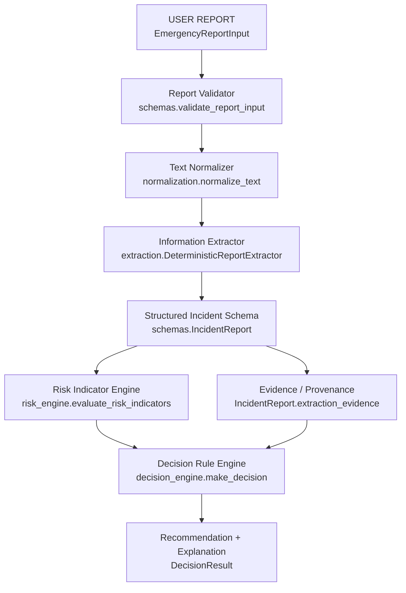

# Phase 2: Emergency Report Intelligence

## 1. Why Phase 2 exists

Phase 1 (see `docs/ML_PIPELINE.md`) predicts crash severity from
already-structured CRSS data. Real-world emergency reports don't
arrive structured -- they arrive as free text from a caller or
dispatcher ("Two cars collided near the highway intersection during
heavy rain..."). Phase 2 builds the layer that turns that free text
into the kind of structured, evidence-backed record a downstream
system (a future adapter to the Phase 1 model, a resource engine, a
dispatcher UI) can actually consume -- without ever inventing
information the report didn't contain.

**ResQAI is a decision-support prototype, not an autonomous dispatch
system.** Nothing in Phase 2 dispatches real emergency services,
performs medically authoritative triage, guarantees response times,
or replaces trained emergency personnel. Every recommendation is
explicitly labeled as a prototype heuristic requiring human review
(see section 14, "Safety limitations").

## 2. Problem definition

**Input:** an unstructured natural-language emergency report (plus
optional metadata: location, timestamp, source).

**Output:** a structured `IncidentReport` (incident type, people,
vehicles, fire, hazmat, environment, location, traffic, emergency
services -- each attribute with a value, a certainty level, and the
text evidence it came from), a list of transparent `RiskIndicator`s,
and a `DecisionResult` (priority, risk level, recommended response
categories, and human-readable reasons).

**Non-goals for Phase 2:** no LLM/cloud API, no internet dependency,
no FastAPI/web service, no frontend, no training of another ML model,
no live emergency-service integration.

## 3. Architecture



`report_parser.parse_report()` wires these stages together and is the
only module that calls all of them; every other module only depends
on `schemas.py` (and, for the extractor, `utils/`). This means:

- `risk_engine.py` and `decision_engine.py` only ever see an
  `IncidentReport` -- they do not know or care whether it was
  produced by regex rules or (in the future) an LLM.
- A new extractor only needs to implement `BaseReportExtractor.extract()`
  (see `extraction/base.py`) and produce the same `IncidentReport`
  shape; nothing downstream changes.

## 4. Input format

`schemas.EmergencyReportInput`: `report_id`, `raw_text`, optional
`latitude`/`longitude`/`timestamp`/`source`. Deliberately minimal --
no reporter name/contact field, since Phase 2 has no legitimate need
to persist that (see section 15, PII).

`schemas.validate_report_input(...)` enforces: `report_id` and
`raw_text` required and non-empty; `raw_text` trimmed of surrounding
whitespace; length capped at `MAX_RAW_TEXT_LENGTH` (5000 chars);
`latitude`/`longitude` numeric and in-range if provided. Violations
raise `ReportValidationError` with a specific, developer-facing
message rather than propagating a malformed value downstream.

## 5. Normalization

`normalization.normalize_text()` is intentionally conservative:
whitespace collapsing, lowercasing, a few unambiguous punctuation
normalizations (curly quotes, en/em dashes), and a small, explicit
abbreviation-expansion table (`w/` -> `with`, `veh` -> `vehicle`, ...).
It never deletes or rewrites content words, and the original
`raw_text` is always kept alongside `normalized_text` on
`IncidentReport` -- normalization never replaces the source of truth.

Synonym handling ("car crash" / "car accident" / "vehicle collision"
/ "cars collided" all meaning the same incident type) is done in the
extractor via multiple keyword patterns pointing at the same
attribute, not by rewriting the text -- rewriting risks silently
changing meaning; matching multiple phrasings does not.

## 6. Extraction

`extraction/deterministic.py`'s `DeterministicReportExtractor` is
regex + heuristics, 100% local, no ML/LLM, no randomness. Text is
split into clauses (on `. ! ? ;`) via `utils/text_rules.split_clauses`,
and every boolean/count attribute is produced by one of two shared
primitives:

- `utils.text_rules.classify_match(clause, match_start)` -- decides
  negation vs. hedging vs. plain statement for a keyword match (see
  section 7-8 below).
- `utils.text_rules.word_to_number(token)` -- parses a digit or a
  spelled-out number word (one-twelve). Vague quantities ("a few",
  "several") are deliberately NOT mapped to an exact integer --
  turning "a few people were hurt" into an exact count would
  fabricate precision the report never gave.

**Simplification, documented:** for each attribute, only the FIRST
matching clause (in reading order) is used. A later retraction in the
same report ("There's a fire. Actually, no fire.") is not reconciled
-- the first mention wins. This keeps the rule set small and testable;
a future extractor could resolve this differently.

## 7. Incident taxonomy & classification

`schemas.IncidentType`: `vehicle_collision`, `fire`,
`medical_emergency`, `hazardous_material`, `natural_disaster`,
`structural_incident`, `road_obstruction`, `other`, `unknown`. Flat and
small by design -- extraction and decision code switch on the enum
value, so appending a new category later needs no other code changes.

Classification (`extraction/deterministic._classify_incident_type`)
checks a fixed precedence order (hazardous material > fire > medical
emergency > structural > natural disaster > vehicle collision > road
obstruction) and returns the first category with a non-negated match.

**Important design choice:** `medical_emergency` only matches specific
primary-medical phrases ("heart attack", "not breathing", "seizure",
...) -- NOT generic injury words like "injured" or "unconscious",
which commonly co-occur with a vehicle collision. This is what keeps
the worked example below classified as `vehicle_collision` rather than
`medical_emergency`, even though people are injured and possibly
unconscious.

If nothing matches, `incident_type = unknown`. Ambiguous input (e.g.
"there is smoke" with no other context) is never forced into a
category it doesn't clearly support -- it stays `unknown`, with
whatever *can* be supported (e.g. `smoke_present`) still recorded and,
where relevant, flagged as a risk indicator (`smoke_detected`; see
section 11).

## 8. Negation handling

`utils.text_rules.is_negated_before(clause, match_start, window=4)`
checks the 4 words immediately preceding a match for a negation cue
(`no`, `not`, `without`, `isn't`, `doesn't`, ...). A negated match
produces `(value=False, certainty=CONFIRMED)` -- "no injuries" is a
*confirmed negative* fact, not a missing one.

```
"no injuries were reported"  -> injuries_present = False [confirmed]
"there is no fire visible"   -> fire_present      = False [confirmed]
"no one was trapped"         -> trapped_person    = False [confirmed]
```

Negation is evaluated per-clause, so a negation in one sentence never
affects a match in a different sentence (`"There is smoke but no fire
is visible."` -> `smoke_present=True`, `fire_present=False`, both
confirmed, independently).

## 9. Uncertainty / hedging

`utils.text_rules.hedge_certainty_in_clause(clause)` checks the whole
clause for hedge language, in two tiers:

- **Soft hedges** (`may`, `maybe`, `possibly`, `might`, `appears`,
  `seems`, `think`, `believe`, ...) -> `Certainty.POSSIBLE`
- **Strong hedges** (`unclear`, `unconfirmed`, `not sure`, `uncertain`)
  -> `Certainty.UNCERTAIN`

An unhedged, non-negated match -> `Certainty.CONFIRMED`. A hedged
statement is *never* promoted to confirmed:

```
"one person may be unconscious"     -> unconscious_person=True [possible]
"I think there is a gas leak"       -> gas_leak=True [possible]
"unclear if anyone is trapped"      -> trapped_person=True [uncertain]
```

## 10. Evidence / provenance

Every attribute is an `ExtractedField[T]` (`schemas.py`): `value`,
`certainty`, and `evidence` (the clause the value came from).
`schemas.build_evidence_list(report)` flattens every *mentioned*
field (certainty != `NOT_MENTIONED`) across all sub-models into
`IncidentReport.extraction_evidence`, so "why did you extract this?"
always has a one-line answer: field name, value, certainty, and the
exact supporting text.

## 11. Confidence

`ConfidenceLevel` (HIGH/MEDIUM/LOW) is deliberately a coarse category,
not a percentage. `report_parser._compute_overall_confidence()`
derives it heuristically: LOW if nothing was extracted at all; HIGH if
the incident type was classified AND at least 3 fields were extracted
with `CONFIRMED` certainty; MEDIUM otherwise. **This is a rule-based
extraction confidence, not a calibrated statistical probability** --
it should not be interpreted as "HIGH = 90%+ correct" or compared
numerically across reports.

## 12. Risk Indicator Engine

`risk_engine.py` -- NOT medical triage. Each rule is a small, named
function `(IncidentReport) -> Optional[RiskIndicator]`, and every
indicator carries `name`, `category` (RiskLevel), `certainty`,
`evidence`, and a plain-language `explanation`. Current indicators:
`possible_fatality`, `explosion_indicator`, `possible_unconscious_person`,
`active_fire`, `smoke_detected` (fires only when fire is NOT already
confirmed, to avoid a redundant indicator), `hazardous_material`,
`possible_trapped_people`, `multiple_injured_people` (requires an
explicit count >= 2), `infrastructure_damage`, `multiple_vehicle_collision`,
`road_blockage`, `severe_weather`. A hedged underlying field generally
produces a lower `category` than a confirmed one (see `risk_engine._flag_indicator`).

## 13. Decision Rule Engine

`decision_engine.py` computes a `priority_score` as the sum, over all
fired risk indicators, of `INDICATOR_BASE_WEIGHT[name] *
CERTAINTY_MULTIPLIER[certainty]`. Base weights and thresholds are
named constants with a one-line rationale comment next to each in the
source -- nothing is an unexplained magic number. Certainty multipliers
(`CONFIRMED=1.0, POSSIBLE=0.7, UNCERTAIN=0.4`) implement the
requirement that uncertain indicators contribute less than confirmed
ones. The resulting score maps to `Priority` (P0-P3) and `RiskLevel`
via fixed thresholds (see `decision_engine._priority_and_risk_level`).

## 14. Recommendation categories

`ResponseCategory`: `ambulance`, `fire_response`, `police_response`,
`traffic_management`, `hazardous_material_response`,
`evacuation_consideration` -- CATEGORIES for a human to consider, never
autonomous dispatch commands. Mapping rules live in
`decision_engine._recommend_categories` (e.g. `ambulance` follows from
any injury-related indicator; `fire_response` from `active_fire` or
`explosion_indicator` or a fire/vehicle-fire flag). Every
`DecisionResult` also carries a fixed `disclaimer` string restating
that this is prototype output requiring human review.

## 15. Separating facts from recommendations

The CLI output (`python -m src.report_parser`) and the design of
`IncidentReport`/`DecisionResult` keep four things visibly distinct:

- **A. Report facts** -- the raw, unmodified `raw_text`.
- **B. Extracted information** -- `IncidentReport` fields with
  certainty and evidence (never presented as if the reporter stated a
  conclusion the system inferred).
- **C. Risk indicators** -- rule-based interpretation of B, explicitly
  labeled as not medical triage.
- **D. Recommendation** -- `DecisionResult`, always with `reasons`
  tracing back to specific indicators and a disclaimer.

## 16. Safety limitations

- **Prototype priority/risk scoring only.** Weights and thresholds in
  `decision_engine.py` are project-defined for this prototype; they
  are not sourced from, or validated against, any real EMS/fire/police
  dispatch priority standard.
- **Not medical triage.** Risk indicators flag *operational* signals
  ("report contains injury language") -- they do not diagnose,
  estimate survival likelihood, or replace a clinician/EMT's judgement.
- **Regex/heuristic extraction has real limits:** sarcasm, unusual
  phrasing, multi-report/garbled text, or language outside the
  patterns encoded in `extraction/deterministic.py` will under-extract
  (fields stay `not_mentioned`) rather than guess -- which is by
  design, but means recall is not complete.
- **First-match-wins per attribute** (section 6) -- later
  corrections/retractions in the same report are not reconciled.
- **PII redaction is best-effort** (`utils/pii.py`): structural
  patterns (email, phone) only; it does not detect names or addresses
  in free text, and makes no legal/regulatory compliance claim.
- **No survey/statistical weighting** -- this is a rule-based system,
  not a trained model; there is no accuracy/precision/recall metric to
  report the way Phase 1 reports model metrics, because there is no
  training or held-out test set here. Correctness is instead verified
  by the scenario-based tests in `tests/`.

## 17. Future LLM architecture

`extraction/base.py` defines `BaseReportExtractor` (the interface) and
a documented, unimplemented `FutureLLMReportExtractor` placeholder. A
real LLM-backed extractor would only need to implement `extract()` and
return the same `IncidentReport` shape `DeterministicReportExtractor`
does -- `risk_engine.py`, `decision_engine.py`, and `report_parser.py`
would need no changes. `report_parser.parse_report(..., extractor=...)`
already accepts a swapped-in extractor.

## 18. Relationship to Phase 1

Phase 2 does **not** call the Phase 1 model. It produces a structured
`IncidentReport` and stops; a future, clearly-documented adapter could
map *some* fields (e.g. `environment.heavy_rain` -> a CRSS-style
weather feature) onto Phase 1's feature schema (see
`src/feature_engineering.py`), but only for fields the report actually
supports -- Phase 1 features the report says nothing about (e.g.
lighting condition) must stay missing, never fabricated, if/when that
adapter is built. No such adapter exists yet; this is a documented
boundary, not an implementation.

## 19. Example end-to-end input/output

Input:

> "Two cars collided near the highway intersection during heavy rain.
> Four people appear injured. One person may be unconscious. Traffic
> is completely blocked."

```
A. FACTS: (the raw text above, unmodified)

B. EXTRACTION (selected fields):
   incident_type       = vehicle_collision (subtype: "cars collided")
   vehicle_count       = 2                 [confirmed]
   injured_people      = 4                 [possible]  (hedged: "appear")
   unconscious_person  = True              [possible]  (hedged: "may be")
   heavy_rain          = True              [confirmed]
   highway             = True              [confirmed]
   intersection        = True              [confirmed]
   traffic_blockage    = True              [confirmed]

C. RISK INDICATORS:
   possible_unconscious_person [high, possible]
   multiple_injured_people     [moderate, possible]
   multiple_vehicle_collision  [moderate, confirmed]
   road_blockage                [moderate, confirmed]
   severe_weather                [moderate, confirmed]

D. RECOMMENDATION:
   priority: P0   risk_level: critical
   recommended_response_categories: ambulance, police_response, traffic_management
   reasons: (one per indicator above, each citing its evidence)
   disclaimer: "Prototype decision-support output only. ... A qualified
                human must review and make all real dispatch decisions."
```

Run `python -m src.report_parser` for this and five more worked
examples (minor collision, fire with trapped people, hazmat, weather +
road blockage, and an intentionally ambiguous smoke-only report).

## 20. Privacy considerations

`EmergencyReportInput` stores only what parsing needs -- no reporter
name/phone/email field. `utils/pii.py` provides best-effort redaction
of emails and phone numbers for use before logging or displaying
report text; reusable modules (`report_parser.py`) never log full raw
text at INFO level, only a redacted excerpt at DEBUG level. No legal
compliance (GDPR, HIPAA, etc.) is claimed or implied by this utility.


---

## Addendum (Phase 6, 2026-09-21): vehicle count

`vehicle_count` is now set **only from an explicit number** ("two cars", "one truck"). An indefinite article ("a truck", "an SUV") only records that a vehicle was *mentioned* (in `vehicle_types`); it no longer produces `vehicle_count = 1`, because "A car hit a parked vehicle" involves two vehicles and "a truck collision" does not say how many. See `docs/FATAL_SKEW_REVIEW.md`.
